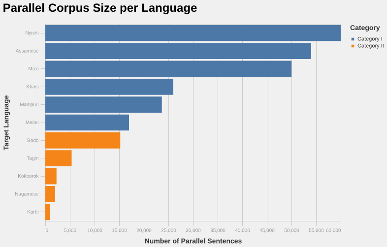
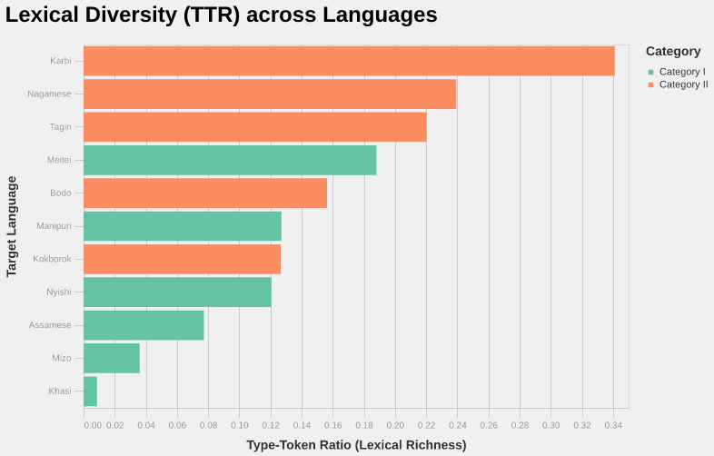
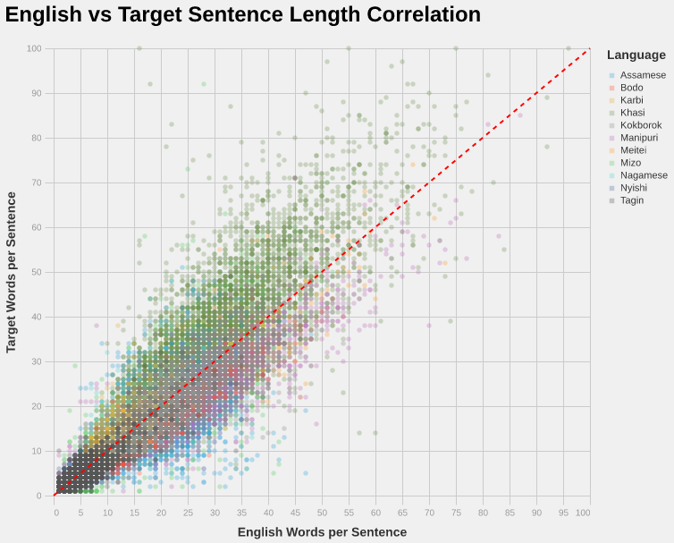
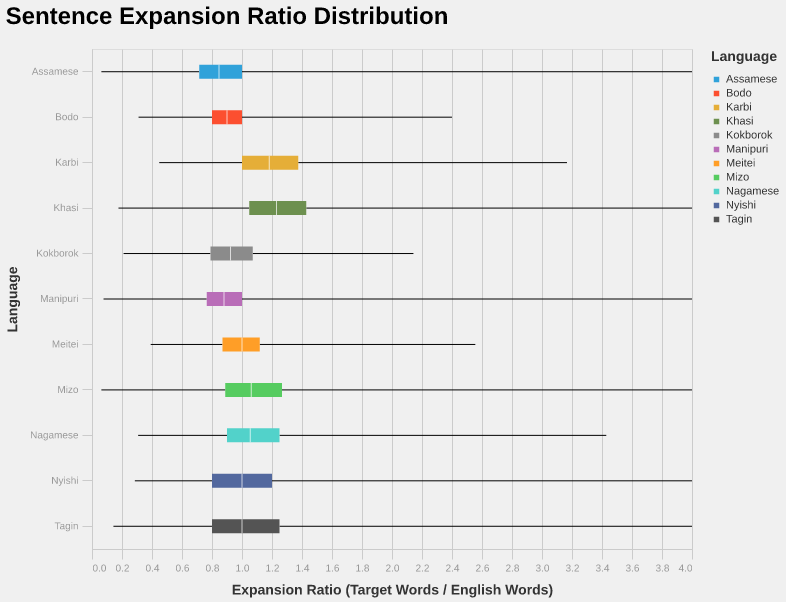

# EMNLP-2026
Low-Resource Indic Language Translation

# [Task](https://www2.statmt.org/wmt26/indic-mt-task.html)

Recent advances in Machine Translation (MT) have significantly improved translation quality across many languages. 
Approaches such as multilingual translation and transfer learning have expanded the reach of MT systems beyond 
well-resourced languages. Yet, extending coverage to diverse, low-resource languages remains a challenge due to the 
limited availability of parallel data for training robust systems. The WMT 2026 Indic Machine Translation Shared Task 
tackles this challenge by focusing on low-resource Indic languages from diverse language families. The focus will be on 
languages like Assamese (an Indo-Aryan language spoken mainly in the north-eastern Indian state of Assam), Mizo 
(a Sino-Tibetan language spoken primarily in the Mizoram state of India), Khasi (an Austroasiatic language spoken in 
Meghalaya, India), Manipuri (also known as Meiteilon, a Sino-Tibetan language and the official language of Manipur, 
India), Nyishi (a Sino-Tibetan language of Arunachal Pradesh, India), and kokborok language (Tibeto-Burman language 
spoken primarily by the Tripuri people).


Category 1: (Moderate Training Data Available)
* en-as: English ⇔ Assamese

* en-lus: English ⇔ Mizo

* en-kha: English ⇔ Khasi

* en-mni: English ⇔ Manipuri

* en-njz: English ⇔ Nyishi

* en-mni-Mtei: English ⇔ Meitei

Category 2: (Very Limited Training Data)
* en-bodo: English ⇔ Bodo

* en-trp: English ⇔ Kokborok

* en-mjw: English ⇔ Karbi

* en-nag: English ⇔ Nagamese

* en-tgj: English ⇔ Tagin

# Data
Data shall be collated through [WMT 2026](https://www2.statmt.org/wmt26/indic-mt-task.html) and is made available at 
[Google Drive](https://drive.google.com/drive/folders/1TsaINvXwb5GbiEbEkj2OgcK-1wfrWESG) by the organizers.

**Note:** Accessed on June 2026

The training data arrangement structure as follows

```commandline
├── train
│   ├── Category I
│   │   ├── English-Assamese Training Data 2026.csv
│   │   ├── English-Khasi Training Data 2026.xlsx
│   │   ├── English-Manipuri Training Data 2026.xlsx
│   │   ├── English-Meitei-Mayek Transining Data 2026.xlsx
│   │   ├── English-Mizo Traning Data 2026.xlsx
│   │   └── English-Nyishi Training Data 2026.xlsx
│   └── Category II
│       ├── English-Bodo Training Data 2026.xlsx
│       ├── English - Karbi Training Data 2026.xlsx
│       ├── English-Kokborok Training Data 2026.xlsx
│       ├── English-Nagamese  Training Data 2026.xlsx
│       └── English-Tagin Training Data 2026.xlsx
└── train-modified
    ├── Category I
    │   ├── English-Assamese.csv
    │   ├── English-Khasi.csv
    │   ├── English-Manipuri.csv
    │   ├── English-Meitei.csv
    │   ├── English-Mizo.csv
    │   └── English-Nyishi.csv
    └── Category II
        ├── English-Bodo.csv
        ├── English - Karbi.csv
        ├── English-Kokborok.csv
        ├── English-Nagamese.csv
        └── English-Tagin.csv
```

# Data Statistics


The bar chart vividly illustrates an extreme data skew, characterized by a heavy head and a highly impoverished tail.

**The Visualization:** Nyishi, Assamese, and Mizo dominate the top with 50,000 to 60,000 sentences. The drop-off is precipitous, terminating in a long tail where Category II languages like Karbi, Nagamese, and Kokborok struggle with barely 1,000 to 2,500 sentences.

**The Interpretation:** If fed into a shared Multimodal, Multilingual, and Multitask (M3) architecture without intervention, the network will heavily bias its weight updates toward the structural patterns of the high-resource languages. The network will likely experience catastrophic forgetting of the Category II languages as training progresses.

**Actionable Takeaway:** Temperature-scaled sampling during data loading is strictly required to artificially upsample the bottom five languages and stabilize the gradient updates.



The Type-Token Ratio (TTR) chart is arguably the most critical for your subword modeling strategy. It exposes severe inconsistencies in how the target languages are written.

**The Visualization:** Karbi and Nagamese shoot massively to the right, showing enormous lexical diversity. Conversely, Khasi barely registers a visible bar on the far left.

**The Interpretation:** The high TTR for transliterated languages (Karbi, Nagamese) strongly implies high orthographic noise—meaning translators are spelling the same phonetics in wildly different ways using the Latin script. Standard tokenization will shatter these noisy words into meaningless fragments. Meanwhile, the practically invisible bar for Khasi (0.008 TTR) visually confirms a fatal flaw in that specific corpus: it is almost certainly choked with duplicated rows or highly rigid, repetitive boilerplate templates.

**Actionable Takeaway:** Khasi requires immediate, aggressive deduplication. For Karbi and Nagamese, subword regularization (like BPE-dropout) will be necessary to force the encoder to learn robust representations despite the spelling variations.



The scatter plot visualizes the density and spread of sequence lengths, which directly impacts computational efficiency.

**The Visualization:** While there is a dense, correlated cluster under 30 words, there is a massive, sparse cloud of points extending all the way to 100 words. Furthermore, you can see distinct color groupings pushing either above or below the red dashed trendline.

**The Interpretation:** For models destined for deployment on mobile or edge devices, memory footprint during inference is paramount. If a batch contains even one of those 90-word outlier sentences, all the 5-word Nyishi sentences in that same batch must be padded with dozens of empty tokens, wasting vast amounts of compute and memory.

**Actionable Takeaway:** Implementing strict dynamic length-bucketing is essential. Grouping sentences of similar lengths ensures matrices remain dense and padding is minimized, drastically speeding up both training and edge inference.



The boxplots directly expose the "Orthographic Divide" we discussed, visually separating the native scripts from the transliterated ones.

**The Visualization:** Look at the median lines (the white line inside the colored boxes). Assamese, Manipuri, and Bodo all have medians pulled strictly to the left of the 1.0 mark (contraction). Khasi and Karbi have their entire boxes shifted to the right of the 1.0 mark (expansion).

**The Interpretation:** Native Indic scripts pack complex syllables efficiently, requiring fewer total words than English. Transliterated Latin scripts require more distinct characters and word breaks to convey the same meaning. Furthermore, the massive right-reaching whiskers (like Nagamese extending past 3.4) show severe structural outliers.

**Actionable Takeaway:** A statically defined generation limit will inherently bias the model. If you tune the output length for Assamese, the model will prematurely truncate transliterated languages, violating neutrality. The shared decoder must rely on language-conditioned, dynamic length penalties.

# Installation
```commandline
git clone https://github.com/rbg-research/EMNLP-2026.git
cd EMNLP-2026
```

```commandline
# Install Python and Libraries
sudo add-apt-repository ppa:deadsnakes/ppa
sudo apt update
sudo apt install -y python3.10 python3.10-dev python3.10-distutils
wget https://bootstrap.pypa.io/get-pip.py
source ~/.bashrc
python3.10 get-pip.py
echo 'export PATH="$HOME/.local/bin:$PATH"' >> ~/.bashrc
source ~/.bashrc
pip3.10 install -U pip
pip3.10 install virtualenv
virtualenv --python=python3.10 "$HOME"/environments/wmt
source "$HOME"/environments/wmt/bin/activate
rm get-pip.py
```

```commandline
pip install -U pip
pip install -r requirements.txt
```